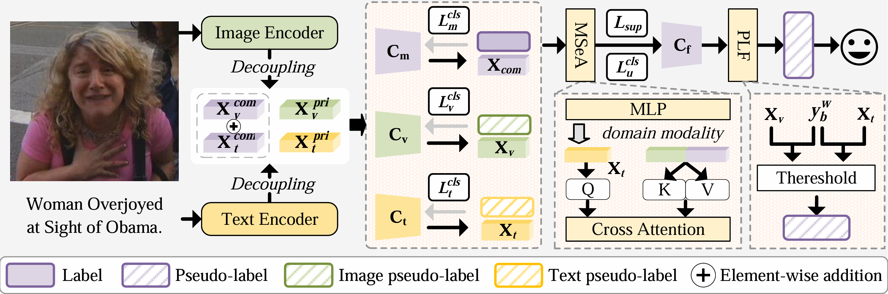

<div align="center">

## Seek Common Ground While Reserving Differences: Semi-supervised Image-Text Sentiment Recognition

<a href="https://pytorch.org/get-started/locally/"></a>

  
</div>

This is the official implement of our paper **Seek Common Ground While Reserving Differences: Semi-supervised Image-Text Sentiment Recognition**.

<div align="center">
    
    <h4 align="center">Overview of SCRD training paradigm.</h4>
</div>


## Abstract

Multimodal sentiment analysis has attracted extensive research attention as increasing numbers of users share images and texts to express their emotions and opinions on social media. Collecting large amounts of labeled sentiment data is an expensive and challenging task due to the high cost of labeling and unavoidable label ambiguity. Semi-supervised learning (SSL) is explored to utilize the extensive unlabeled data to alleviate the demand for annotation. However, different from the typical multimodal tasks, the inconsistent sentiment between image and text leads to the sub-optimal performance of the SSL algorithms. To address the issue, we propose SCRD, the first semi-supervised image-text sentiment recognition framework. To better utilize the discriminative features of each modality, we decouple features into common and private parts. We then use the private features to train unimodal classifiers for enhanced modality-specific sentiment representation. Considering the complex relation between modalities, we devise a modal selection-based attention module that adaptively assesses the dominant sentiment modality at the sample level to guide the fusion of multimodal representations. Furthermore, to prevent the model predictions from overly relying on common features under the guidance of multimodal labels, we design a pseudo-label filtering strategy based on the matching degree of prediction and dominant modality. Extensive experiments and comparisons on five publicly available datasets demonstrate that SCRD outperforms state-of-the-art methods.


## Prerequisites
- Python >= 3.6
- Pytorch >= 1.8.0
- Install [libKMCUDA](https://github.com/src-d/kmcuda) based on your cuda version
- Others (transformers, etc.) Check requirements.txt for reference.

## Training
To perform a training on MVSA-Single with 600 labels, run:

```
python main.py \
--data_dir 'dataset/MVSA_Single' \
--train_data_dir 'dataset/MVSA_Single' \
--test_data_dir 'dataset/MVSA_Single' \
--gpu 0 \
--save_dir './saved_models-single/n600' \
--lr 1e-4 \
--batch_size 2 \
--num_labels 600 \
--threshold 0.95 \
--num_train_iter 512 
```
